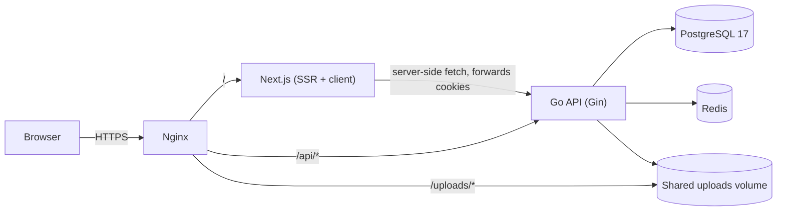
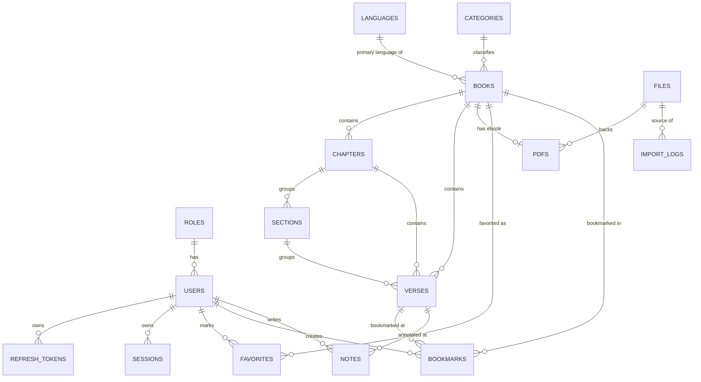

# Architecture

## Stack overview



- **Nginx** is the single public entry point. It same-origins the frontend and
  backend (so auth cookies need no cross-origin dance), serves uploaded
  covers/PDFs directly from a shared volume, and terminates TLS in production.
- **Frontend** (Next.js 15+/React 19 App Router) renders Server Components for
  first-load pages (book detail, reader) and uses TanStack Query for
  client-side interactivity (favorites, infinite scroll, live search).
- **Backend** (Go/Gin) is a clean-architecture service: `domain` (entities +
  repository interfaces) ← `repository/postgres` + `repository/redis`
  (implementations) ← `service` (business logic) ← `handler` (HTTP). Handlers
  and repositories never talk to each other directly — only through the
  domain interfaces — so either can be swapped or unit-tested independently.
- **PostgreSQL** holds all relational data, including generated `tsvector`
  columns for full-text search (see below).
- **Redis** caches book detail, popular books, chapter content, and search
  results (cache-aside, explicit invalidation on writes — see
  `internal/service/cache_service.go`).

## Backend package layout

```
backend/
  cmd/api/            entrypoint: config, DI wiring, graceful shutdown
  internal/
    domain/           entities + repository interfaces (no framework imports)
    repository/
      postgres/        GORM + raw pgx (COPY, full-text search)
      redis/           not currently separate; cache lives in pkg/cache
    service/           business logic, depends only on domain interfaces
    handler/
      public/          auth, books, search, favorites, bookmarks, notes
      admin/           books CRUD, import, reference data, users, audit
    middleware/        auth, RBAC, CORS, CSRF, rate limit, audit, recovery
    dto/               HTTP request/response shapes + domain<->DTO mappers
    router/            wires handlers + middleware to routes
  pkg/                 framework-agnostic utilities (jwt, hash, storage,
                       cache, pagination, validator, apperror, response)
  migration/           golang-migrate SQL, one file pair per change
```

## Entity-relationship diagram



Full column-level detail lives in the migrations themselves
(`backend/migration/0000XX_*.sql`) — they are the source of truth; this
diagram shows relationships, not every column/constraint.

## Full-text search

`books.search` and `verses.search` are PostgreSQL **generated, stored**
`tsvector` columns (see migrations `000009` and `000012`) built from
`to_tsvector('english', text_en) || to_tsvector('indonesian', text_id)`
(weighted `setweight` for verses; title/author/ISBN/description for books).
Both have a GIN index. Search queries use `websearch_to_tsquery` so end users
can type natural queries (quoted phrases, `-exclusion`, `OR`).

## Caching

| What | Key prefix | TTL | Invalidated on |
|---|---|---|---|
| Book detail | `cache:book:detail:<slug>` | 5m | book update/delete, import touching that book |
| Chapter content | `cache:book:<id>:chapter:<n>` | 10m | import touching that book |
| Popular books | `cache:books:popular:*` | 2m | any book update/delete/import |
| Search results (first page only) | `cache:search:*` | 60s | any completed import |

See `internal/service/cache_service.go` for the exact key builders.

## Import pipeline performance

See [flow-import.md](flow-import.md) for the full walkthrough. In short:
`excelize`'s streaming row reader avoids loading the whole spreadsheet into
memory, verses are merged in `importBatchSize` (2000-row) batches via a
PostgreSQL `COPY` into a temp staging table followed by one set-based
`INSERT ... SELECT ... ON CONFLICT`, and per-batch progress is persisted to
`import_logs` so the admin UI's SSE stream (`GET
/admin/import/:id/stream`) can show live progress.
