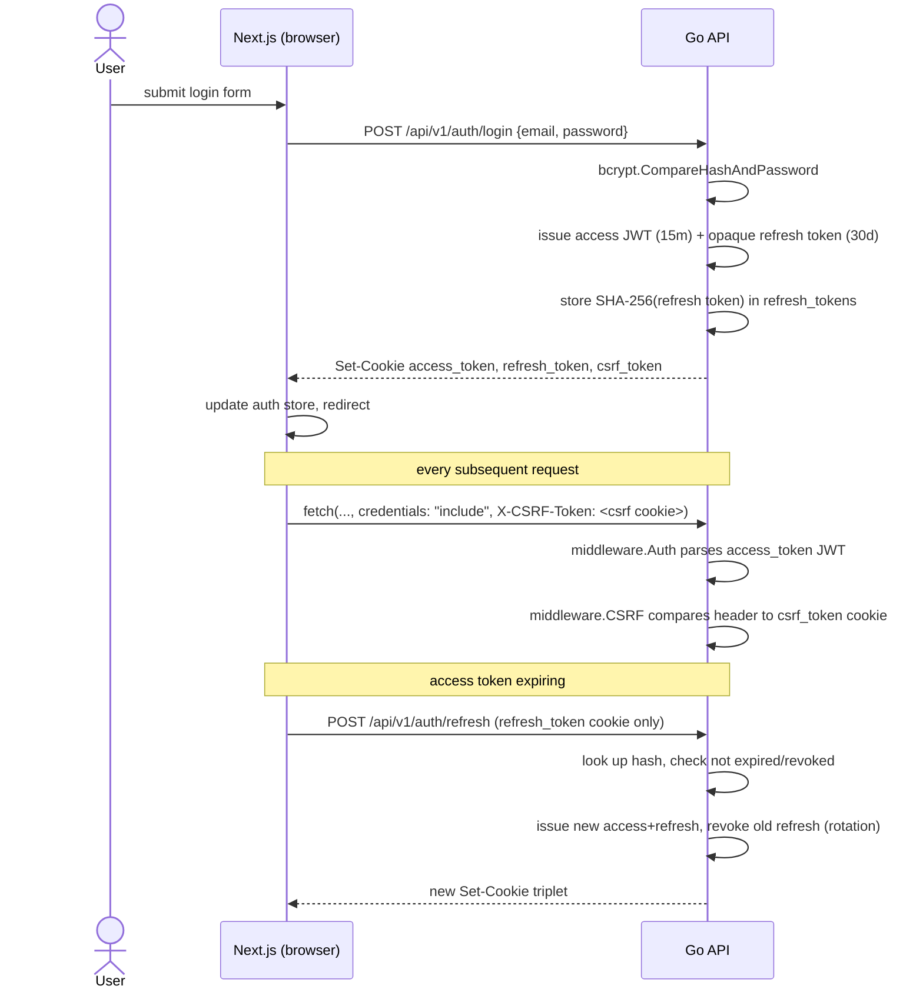

# Authentication flow

JWT access tokens + rotating opaque refresh tokens, delivered as httpOnly
cookies. See `backend/internal/service/auth_service.go`,
`backend/internal/handler/public/auth_handler.go`, and
`frontend/hooks/use-auth.ts`.

## Why this shape

- **Access tokens are JWTs** (stateless, cheap to verify on every request) but
  **refresh tokens are opaque random strings**, not JWTs — their hash is
  checked against the `refresh_tokens` table on every use, which is what lets
  the server actually *revoke* a session (a JWT can't be un-issued before it
  expires).
- **Rotation.** Every refresh revokes the old refresh token and issues a new
  one (`replaced_by_id` links them), so a stolen-and-reused refresh token is
  detectable after the legitimate client's next refresh.
- **httpOnly, SameSite=Strict cookies**, not `localStorage` — inaccessible to
  JS, which closes the most common XSS-driven token-theft vector.
- **CSRF double-submit.** Because the cookies are httpOnly, a separate
  JS-readable `csrf_token` cookie is set alongside them; every non-GET request
  must echo it back as `X-CSRF-Token`. Combined with `SameSite=Strict`, this
  covers both modern and legacy-browser CSRF vectors (`pkg/csrf`,
  `internal/middleware/csrf.go`).
- **RBAC.** The JWT carries a `role` claim (`admin`/`editor`/`user`/`guest`);
  `middleware.RequireRole(...)` gates admin routes. The frontend's
  `/admin/layout.tsx` also re-checks the role server-side via `GET /me`
  before rendering, rather than trusting client-side route guards alone.
