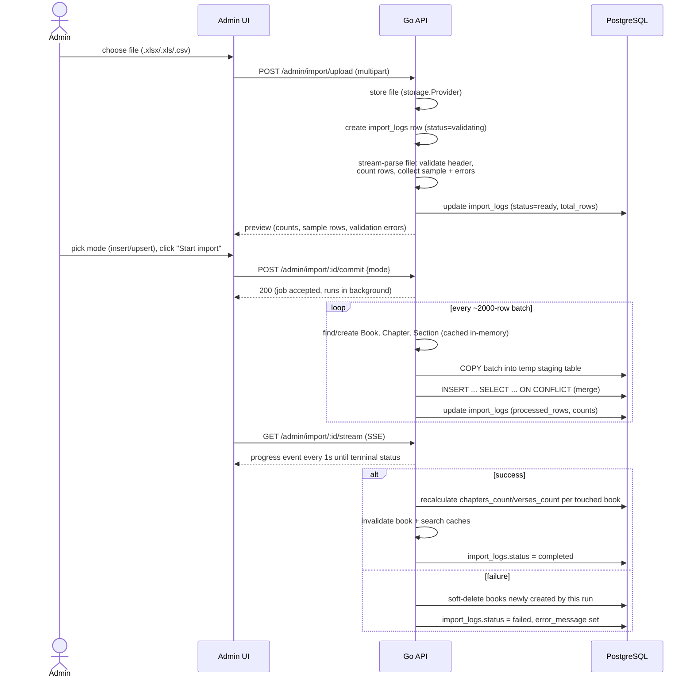

# Import flow

End-to-end path for turning an Excel/CSV file into Book → Chapter → Section →
Verse rows, as implemented in `backend/internal/service/import_service.go`
and driven by the admin UI at `frontend/app/[locale]/admin/import/page.tsx`.

## Design decisions

- **Streaming parse.** `excelize`'s `Rows()` iterator (xlsx) and a buffered
  `encoding/csv.Reader` (csv) never load the whole file into memory — required
  to make a 1M+ row import feasible at all.
- **Batched COPY, not one giant transaction.** Each batch is its own
  transaction (COPY into a temp table + one set-based merge). This is what
  makes 1M+ row throughput possible, but it means failure recovery is a
  **compensating action**, not a database ROLLBACK — see the trade-off
  documented at the top of `import_service.go`.
- **Duplicate detection.** `insert` mode uses `ON CONFLICT (chapter_id,
  number) DO NOTHING` (existing verses are skipped and counted);` upsert` mode
  uses `DO UPDATE` (existing verses are overwritten and counted separately).
- **Sections.** The Excel `title_en`/`title_id` columns are a heading that
  repeats across many consecutive verse rows (e.g. "Creation" for Genesis
  1:1-1:5). Rather than duplicate that text on every verse, the importer
  normalizes it into a `sections` row the first time it sees that heading in
  a chapter, and extends `end_verse_number` as more matching rows arrive.
- **Rollback scope.** On failure, only books this run itself created are
  removed (cascading to their chapters/sections/verses via FK `ON DELETE
  CASCADE`). If the run was upserting into an already-existing book, verses
  merged before the failure are left in place — documented as a known
  trade-off, not silently swept under the rug.
