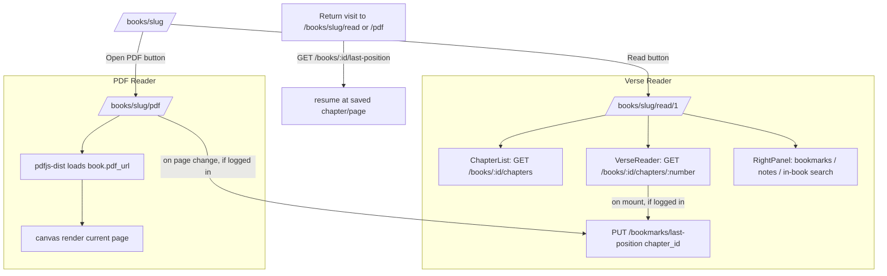

# Reader flow

Two independent readers share a book: the **verse reader** (chapter/section/verse
text, EN/ID side-by-side) and the **PDF reader** (`pdf.js`-based). Both persist
"last read position" the same way.

## Verse reader

- **Data shape.** `GET /books/:id/chapters/:number` returns the chapter, its
  `sections` (heading groups), and all `verses` in one call — the frontend
  groups verses under their section client-side (`groupBySection` in
  `verse-reader.tsx`) rather than issuing N+1 requests.
- **Per-verse actions** (copy, highlight, bookmark, note, share) live in
  `VerseItem`. Highlights are device-local (`store/highlights-store.ts`,
  persisted to `localStorage`) since there is no `highlights` table in the
  schema yet — bookmarks and notes are the account-synced equivalents.
- **Font size / EN·ID·both toggle** are user preferences persisted to
  `localStorage` (`store/reader-preferences-store.ts`), not synced to the
  account — they are reading-device UI state, not content.
- **In-book search** (`RightPanel`'s Search tab) calls the same
  `/search/verses` endpoint as the global search page, scoped with
  `book_id`.

## PDF reader

- Built directly on `pdfjs-dist` (no wrapper library) — see
  `features/reader/components/pdf-viewer.tsx` and `hooks/use-pdf-document.ts`.
  The worker script is copied into `public/pdfjs/` at install time
  (`scripts/copy-pdf-worker.js`) so it's served same-origin, versioned to
  match the installed `pdfjs-dist` exactly.
- **Zoom** re-renders the current page's canvas at a new `scale`. **Search**
  walks every page's extracted text client-side and lets the reader jump to
  matching pages (no in-page highlight overlay — a deliberate scope cut, see
  the comment in `pdf-viewer.tsx`). **Dark mode** is a CSS `invert()` filter
  on the canvas, not a PDF re-render. **Fullscreen** uses the standard
  `Fullscreen` browser API on the viewer's container.

## "Remember last page"

Implemented as a single `is_auto=true` row per `(user_id, book_id)` in
`bookmarks`, enforced by a partial unique index
(`uq_bookmarks_auto_position`) and upserted via `PUT
/bookmarks/last-position`. The verse reader saves at chapter granularity (on
chapter mount); the PDF reader saves on every page change. Both read it back
via `GET /books/:id/last-position` to resume on the next visit.
